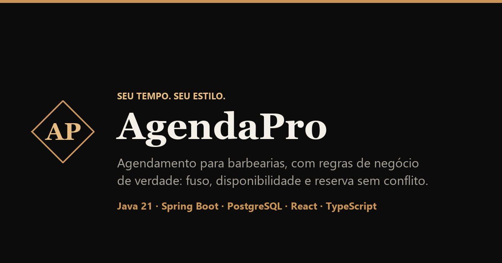

# AgendaPro Web

[](https://github.com/msampaio-dev/AgendaPro-Web/actions/workflows/frontend-ci.yml)
[](https://react.dev/)
[](https://www.typescriptlang.org/)
[](LICENSE)



Interface web do **AgendaPro**, uma plataforma de agendamento para barbearias criada para transformar regras de backend em uma experiência clara para clientes, profissionais, proprietários e administradores.

É uma SPA completa, integrada a uma API publicada, com autenticação, rotas protegidas, disponibilidade calculada, gestão de equipe, agenda profissional e painel administrativo.

> **Demonstração online:** [agenda-pro-web-agendapro2.vercel.app](https://agenda-pro-web-agendapro2.vercel.app/)
> **Backend Java/Spring Boot:** [msampaio-dev/AgendaPro](https://github.com/msampaio-dev/AgendaPro)

## Teste como um usuário real

Na tela de login, use a opção de **conta demonstrativa** para conhecer o produto sem precisar preparar dados manualmente.

Um bom roteiro para avaliar o projeto:

1. entre com a conta demonstrativa;
2. escolha uma barbearia, um profissional e um serviço;
3. adicione barba, se quiser;
4. consulte as próximas datas disponíveis;
5. conclua uma reserva;
6. abra **Meus agendamentos** para acompanhar ou cancelar;
7. explore a agenda, a disponibilidade e a gestão da barbearia pelo perfil profissional.

Os dados do ambiente demonstrativo são fictícios e compartilhados. A API utiliza hospedagem gratuita e hiberna quando fica sem uso: o primeiro acesso pode levar até cerca de um minuto, e a tela avisa enquanto o servidor acorda.

## Experiência por perfil

### Cliente

- cadastro e login;
- seleção por barbearia e profissional;
- catálogo e preços específicos de cada unidade;
- serviço principal com adicional de barba;
- sugestão automática das próximas datas livres;
- escolha de outro dia pelo calendário;
- histórico de reservas e cancelamento.

### Profissional e proprietário

- agenda semanal com filtros e detalhes do atendimento;
- confirmação e conclusão de agendamentos;
- jornada de trabalho com intervalo de almoço;
- bloqueios e horários extras por data;
- criação e edição da própria barbearia;
- foto, endereço e funcionamento da unidade;
- catálogo de serviços e associação por profissional;
- convites, equipe e transferência de propriedade.

### Administrador

- dashboard com visão da operação;
- gestão de usuários e reativação de contas;
- gestão de profissionais e transferências entre unidades;
- administração de barbearias;
- filtros de agenda, paginação e mudança de status.

## Escolhas de experiência

- **Fluxo progressivo:** cada etapa do agendamento libera somente o que já pode ser escolhido.
- **Datas úteis primeiro:** o cliente recebe sugestões com horários disponíveis, em vez de procurar dia por dia.
- **Estado consistente:** trocar barbearia, profissional ou serviço limpa escolhas que deixaram de ser válidas.
- **Fuso do profissional:** a data mínima e os horários são apresentados de acordo com a localidade do atendimento.
- **Erros compreensíveis:** respostas da API são transformadas em mensagens úteis para a pessoa usuária.
- **Funciona no celular:** os fluxos principais são testados em telas de desktop e de celular.
- **Acesso por perfil:** as rotas e opções visíveis acompanham as permissões recebidas na sessão.

## Stack

- React 19
- TypeScript 6
- Vite 8
- React Router
- CSS Modules
- Vitest
- Testing Library e JSDOM
- Playwright
- Oxlint
- GitHub Actions
- Vercel

## Organização do código

O frontend segue a mesma ideia do backend: organização por funcionalidade, mantendo páginas, tipos e acesso à API próximos do contexto em que são usados.

```text
src
├── components
├── config
├── features
│   ├── admin
│   ├── agendamentos
│   ├── auth
│   ├── convites
│   └── profissional
├── hooks
├── pages
├── services
└── test
```

```text
Página/Componente
      │
      ▼
API da funcionalidade ──► cliente HTTP compartilhado
      │
      ▼
AgendaPro API ──────────► regras de negócio + PostgreSQL
```

O frontend não tenta reproduzir regras críticas do backend. Ele orienta o usuário e faz validações de experiência; disponibilidade, permissões e conflitos continuam sendo decididos pela API.

## Executando localmente

### Pré-requisitos

- Node.js 22;
- AgendaPro API em execução.

Instale as dependências:

```bash
npm install
```

Crie um `.env.local` se a API não estiver no endereço padrão:

```env
VITE_API_URL=http://localhost:8080/api/v1
```

Inicie o frontend:

```bash
npm run dev
```

A aplicação estará em [http://localhost:5173](http://localhost:5173).

## Testes e qualidade

Execute toda a verificação antes de enviar uma alteração:

```bash
npm run test:all
```

Na última verificação local, passaram:

- **46 testes** de componentes, hooks, formatação e integração com o cliente HTTP;
- **8 cenários E2E** com Playwright;
- fluxos E2E em desktop e mobile;
- lint com Oxlint;
- checagem TypeScript e build de produção.

Os testes de componentes usam Vitest, Testing Library e JSDOM. As respostas da API são controladas para validar cada estado da interface com rapidez e determinismo.

Os testes ponta a ponta executam login, agendamento, agenda profissional e administração em um navegador real. A API é interceptada nesses testes para não criar registros no ambiente publicado.

Comandos individuais:

```bash
npm run lint
npm run test
npm run test:e2e
npm run build
```

O GitHub Actions executa lint, testes, Playwright e build em todo push e pull request para `main`.

## Integração com o backend

O endereço da API é lido de `VITE_API_URL` e utiliza `http://localhost:8080/api/v1` como padrão local.

O cliente HTTP compartilhado é responsável por:

- montar a URL da API;
- enviar o JWT no cabeçalho `Authorization`;
- interpretar respostas vazias e JSON;
- normalizar erros da API;
- resolver URLs das fotos armazenadas pelo backend.

A sessão é mantida no `sessionStorage`: ela sobrevive à atualização da página, mas é removida quando a sessão do navegador termina ou quando o usuário sai.

## Deploy

O frontend está publicado na **Vercel**. O backend Spring Boot é implantado separadamente e sua URL é configurada por variável de ambiente, mantendo o mesmo build reutilizável entre desenvolvimento e produção.

**Aplicação:** [https://agenda-pro-web-agendapro2.vercel.app](https://agenda-pro-web-agendapro2.vercel.app/)

## O que este projeto demonstra

- integração de uma SPA com API REST autenticada;
- modelagem de interfaces para múltiplos perfis;
- estado assíncrono e prevenção de respostas fora de ordem;
- formulários, filtros, paginação e feedback de operações;
- design responsivo sem depender de biblioteca visual pronta;
- testes de comportamento em componentes e navegador;
- pipeline de qualidade e deploy contínuo.

## Limitações conhecidas

- **Primeiro acesso lento.** A API hiberna no plano gratuito e pode levar até cerca de um minuto para responder. A tela avisa que o servidor está sendo acordado e preserva a sessão enquanto espera.
- **Imagens pesadas.** As fotos chegam do backend no tamanho original, então a lista de barbearias pode baixar alguns megabytes no primeiro acesso; o cache do navegador cobre as visitas seguintes.
- **Sem monitoramento de erros.** Há um limite de erro que evita tela branca, mas falhas não são reportadas a nenhum serviço externo.
- **Ambiente demonstrativo compartilhado.** Os dados são fictícios e podem ser alterados por qualquer visitante.

## Autor

Desenvolvido por **Marcelo Sampaio** como projeto de portfólio full stack, com foco principal em backend Java e uma interface capaz de demonstrar o produto de ponta a ponta.

- GitHub: [@msampaio-dev](https://github.com/msampaio-dev)
- Backend: [AgendaPro](https://github.com/msampaio-dev/AgendaPro)

---

Se você está avaliando este projeto, comece pela demonstração online e depois visite o backend: é lá que estão as principais regras de disponibilidade, segurança e concorrência. Nos dois repositórios, as mensagens de commit explicam o porquê de cada escolha.
